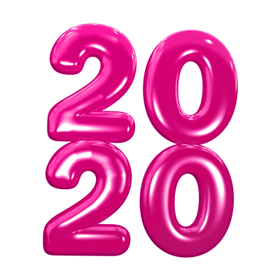

### Overview

  
  This past year has been chaotic for everyone. Think through how you might remember this past year and how you might communicate it to people in the future. Develop a set of 10 images that function as a series – while they&rsquo;re all different images, they should feel like they belong to part of the same collection. Once you&rsquo;ve landed on a clear collection, assemble it into a hand coded website.

### Consider
- Try to think past the obvious associations with the year and think about how your collection offers a different perspective that only you have to offer.
- Consider formal qualities and techniques that can help unify the imagery (color, photographic treatment, size, crop, content)
- How should the images be organized on the website? How does the impact change when you can see the entire collection right away vs. one at a time?
- Do your images speak for themselves or do they need additional content? Consider adding captions and a title for additional context.

### Specs
- HTML and CSS website
- 10 images that you&rsquo;ve either created or modified on your own.

### Learning Goals
- Develop a narrative through images
- Consider what makes images from various sources feel unified
- Think through website organization
- Familiarize ourselves with HTML and CSS

### Suggested Reading
- <a href="https://anthology.rhizome.org/9-eyes" target="_blank">Nine Eyes of Google Street View</a>
- <a href="../assets/readings/paglen.pdf" target="_blank">The Last Pictures: Interview with Trevor Paglen</a>
- <a href="https://subpixel.space/entries/premonition/" target="_blank">Premonition – Toby Shorin, Drew Austin, Kara Kittel, Edouard Urcades</a>

### Due Date
09/28
