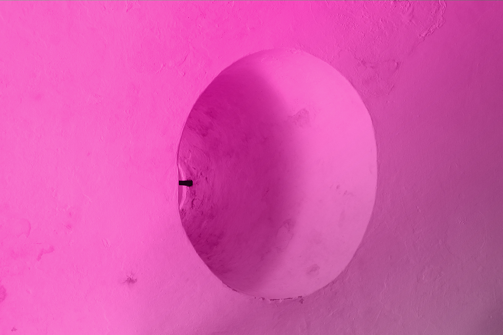

### Overview

  What does accessibility mean? What kinds of insights and experiences do you have that other people do not? Where do you find blocks of knowledge – where only certain audiences are allowed to participate? As a class, we&rsquo;ll explore designing for accessibility – both in its traditional form, and in an abstracted way that is rooted in our own backgrounds and experiences. I&rsquo;d like us all to reflect on our privileges and biases and how we can connect with communities outside of our own.

Pick an experience you’d like to make more accessible and develop a “channel” of 5 digital explorations on that subject. Your experience can be a tangible idea – for example, clothing that is only designed for able-bodied people; or something more ephemeral – like a topic that is traditionally written about in academic language.

Each digital exploration should feel like part of the same system, but can be different in media (audio, website, gif, video, animation). Connect all 5 explorations to a central hub that you’ll design and present at the end of the semester.

### Learning Goals
- To develop an independent research project
- To synthesize research into a multidisciplinary design project
- To experiment with audio, video, animation, and still imagery
- To build on all the skills we&rsquo;ve developed throughout the semester

### Due date
12/07 and 12/09
